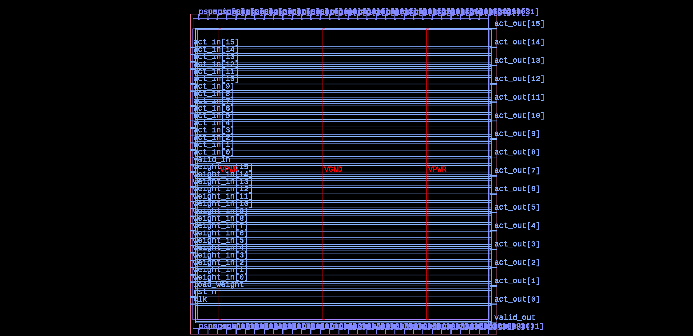
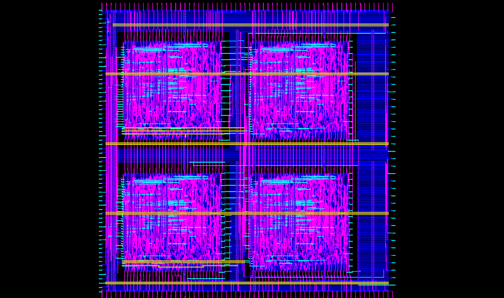

# Hierarchical Physical Design of 2x2 Systolic Array (SkyWater 130nm)

Hierarchical ASIC Implementation and Sign-off of a 2x2 Systolic Array architecture targeting the open-source **SkyWater 130nm (sky130_fd_sc_hd)** PDK via the **OpenLane / OpenROAD** EDA flow.

---

## 🖼️ Physical Layouts

| Processing Element (Hard Macro) | 2x2 Systolic Array (Top Level) |
| :---: | :---: |
|  |  |
| **PE Hard Macro** ($240 \times 240\ \mu\text{m}$) | **Top-Level Array** ($650 \times 650\ \mu\text{m}$) |

---

## 📌 Architecture & Design Highlights
- **Architecture**: 2x2 2D Systolic Array with 4 Hard Macros (`processing_element`).
- **Data Precision**: 16-bit Activation inputs, 16-bit Weights, 32-bit Partial Sum outputs.
- **Implementation Strategy**: Hierarchical Hard Macro packaging, Top-level Floorplanning with cross-routing channels, Manual Macro placement, and Peripheral Pin Distribution.

## 📊 Physical Sign-off Metrics

| Metric | Target / Specification | Achieved Value | Status |
| :--- | :--- | :--- | :--- |
| **Process Node** | SkyWater 130nm | 1P5M CMOS | Clean |
| **Die Dimensions** | $650 \times 650\ \mu\text{m}$ | $0.4225\ \text{mm}^2$ | Verified |
| **Target Clock** | $10.0\ \text{ns}\ (100.0\ \text{MHz})$ | $100\ \text{MHz}$ | **MET** |
| **Worst Setup Slack (WNS)** | $\ge 0.0\ \text{ns}$ | **0.00 ns** | **Clean** |
| **Worst Hold Slack (WHS)** | $\ge 0.0\ \text{ns}$ | **0.00 ns** | **Clean** |
| **Magic DRC Errors** | 0 | **0** | **Clean** |
| **KLayout LVS Errors** | 0 | **0** | **Clean** |
| **Total Standard Cells** | - | 14,292 cells | Top Level |

## 📁 Repository Structure
- `rtl/`: Top-level Verilog/SystemVerilog RTL and macro blackbox definitions.
- `processing_element/`: Standalone Hard Macro implementation and configuration.
- `tb/`: Verification testbenches (functional matrix multiplication verification).
- `signoff_deliverables/`: Final tape-out deliverables (GDSII, LEF, DEF, SDC, SDF, SPEF).
- `images/`: High-resolution layout captures from KLayout.